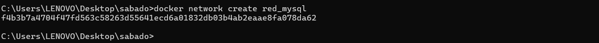
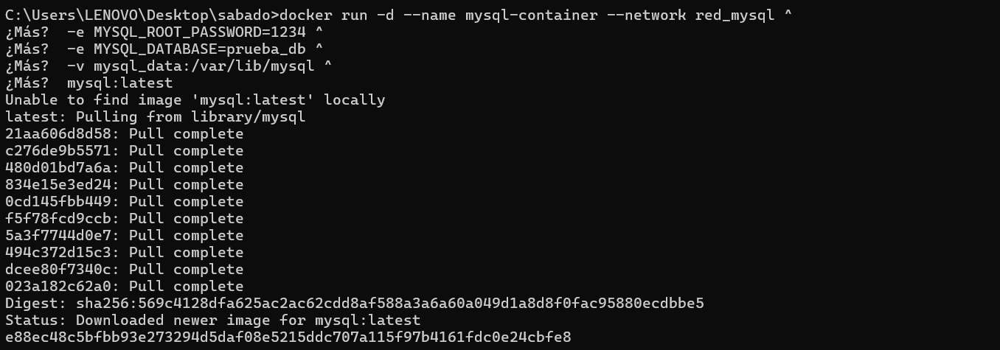
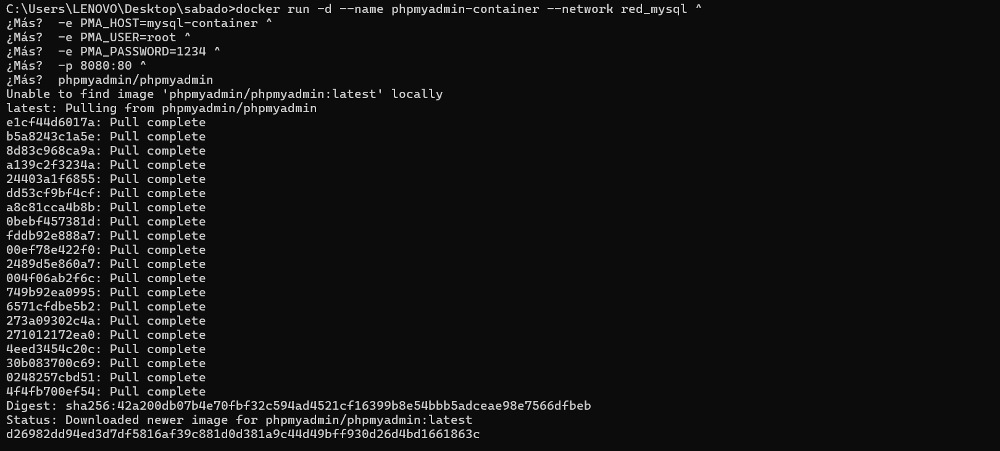
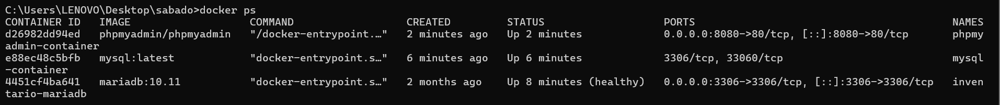

# Práctica TAS4 - Red de contenedores MySQL y phpMyAdmin

## 1. Título
Red de contenedores con MySQL y phpMyAdmin usando Docker.

## 2. Tiempo de duración
40 minutos

## 3. Fundamentos

Docker es una plataforma que permite crear, desplegar y ejecutar aplicaciones dentro de contenedores. Un contenedor es un entorno aislado que contiene todo lo necesario para ejecutar una aplicación: código, librerías, dependencias y configuraciones. Esto garantiza que la aplicación funcione de manera consistente en diferentes entornos, ya sea en desarrollo, pruebas o producción.

En esta práctica, utilizamos Docker para crear contenedores de MySQL, un sistema de gestión de bases de datos, y phpMyAdmin, una interfaz web que permite administrar MySQL de manera gráfica. Para que ambos contenedores se comuniquen, se utiliza una red personalizada en Docker, lo que asegura que los datos puedan transferirse de forma segura y eficiente entre ellos.

## 4. Conocimientos previos

Para realizar esta práctica se requiere:

- Conocimiento básico de Docker, incluyendo cómo ejecutar contenedores y listar imágenes.
- Familiaridad con MySQL, creación de bases de datos y tablas.
- Manejo básico de línea de comandos (terminal o consola).
- Conocimiento de redes en Docker, especialmente redes de tipo bridge.
- Uso de navegadores para acceder a interfaces web (phpMyAdmin en localhost:8080).

## 5. Objetivos a alcanzar

- Aprender a crear y ejecutar contenedores Docker para aplicaciones de base de datos y gestión web.
- Configurar variables de entorno para personalizar la instalación de MySQL y phpMyAdmin.
- Crear y usar redes personalizadas en Docker para permitir la comunicación entre contenedores.
- Acceder a la interfaz web de phpMyAdmin para administrar bases de datos de manera gráfica.
- Comprender la integración de contenedores como un entorno de desarrollo consistente y aislado.

## 6. Equipo necesario

- Computadora o laptop con sistema operativo compatible (Windows, macOS o Linux).
- Docker Desktop instalado y funcionando correctamente.
- Navegador web moderno (Chrome, Firefox, Edge, etc.) para acceder a phpMyAdmin.
- Conexión a Internet estable para descargar imágenes de Docker.
- Terminal o consola de comandos para ejecutar instrucciones Docker.

## 7. Material de apoyo

- Documentación oficial de Docker: https://docs.docker.com
- Documentación oficial de MySQL: https://dev.mysql.com/doc/
- Documentación oficial de phpMyAdmin: https://www.phpmyadmin.net/docs/
- Tutoriales y guías de instalación de Docker con MySQL y phpMyAdmin (ejemplos en blogs y repositorios de GitHub).
- Videos educativos sobre manejo de contenedores y redes en Docker.

## 8. Procedimiento

### Paso 1: Crear la red personalizada
Crear una red de Docker que permite la comunicación entre ambos contenedores:

```cmd
docker network create red_mysql
```
**Figura 1-1. Creación de red personalizada.**  


---

### Paso 2: Crear el contenedor de MySQL
Se crea el contenedor de la base de datos con las variables de entorno necesarias:

```cmd
docker run -d --name mysql-container --network red_mysql ^
 -e MYSQL_ROOT_PASSWORD=1234 ^
 -e MYSQL_DATABASE=prueba_db ^
 -v mysql_data:/var/lib/mysql ^
 mysql:latest
```
**Figura 2-2. Creación del contenedor MySQL.**  


---

### Paso 3: Crear el contenedor de phpMyAdmin
Se ejecuta el contenedor phpMyAdmin conectado a la misma red:

```cmd
docker run -d --name phpmyadmin-container --network red_mysql ^
 -e PMA_HOST=mysql-container ^
 -e PMA_USER=root ^
 -e PMA_PASSWORD=1234 ^
 -p 8080:80 ^
 phpmyadmin/phpmyadmin
```
**Figura 2-3. Creación del contenedor phpMyAdmin.**  


---

### Paso 4: Verificar contenedores activos
Usar el siguiente comando para comprobar que ambos contenedores se esten ejecutando correctamente

```cmd
docker ps
```
**Figura 2-4. Contenedores activos.**  


---

### Paso 5: Acceso a phpMyAdmin
Se accede al servicio phpMyAdmin desde el navegador mediante la URL:

```
http://localhost:8080
```
**Usuario:** root  
**Contraseña:** 1234  

**Figura 2-5. phpMyAdmin funcionando correctamente.**  


---
## 9. Resultados esperados

- Los contenedores de MySQL y phpMyAdmin deben estar activos y vinculados a través de la red llamada red_mysql.
- Desde phpMyAdmin debe ser posible acceder a la base de datos prueba_db.
- Se debe poder crear nuevas tablas y consultar la estructura de los datos almacenados.
- Los contenedores deben mantener la información incluso después de reiniciarse, gracias al uso del volumen mysql_data.

**Figura 3-1. Resultado final: interfaz de phpMyAdmin con base de datos creada.**  


## 10. Bibliografia

- Docker Inc. (2025). Docker Documentation. Recuperado de https://docs.docker.com
- Oracle Corporation. (2025). MySQL Reference Manual. Recuperado de https://dev.mysql.com/doc/
- phpMyAdmin Project. (2025). phpMyAdmin Documentation. Recuperado de https://www.phpmyadmin.net/docs/
- Turnbull, J. (2018). The Docker Book: Containerization is the new virtualization. Shelter Island: James Turnbull.
- Merkel, D. (2014). Docker: Lightweight Linux Containers for Consistent Development and Deployment. Linux Journal, 2014(239).